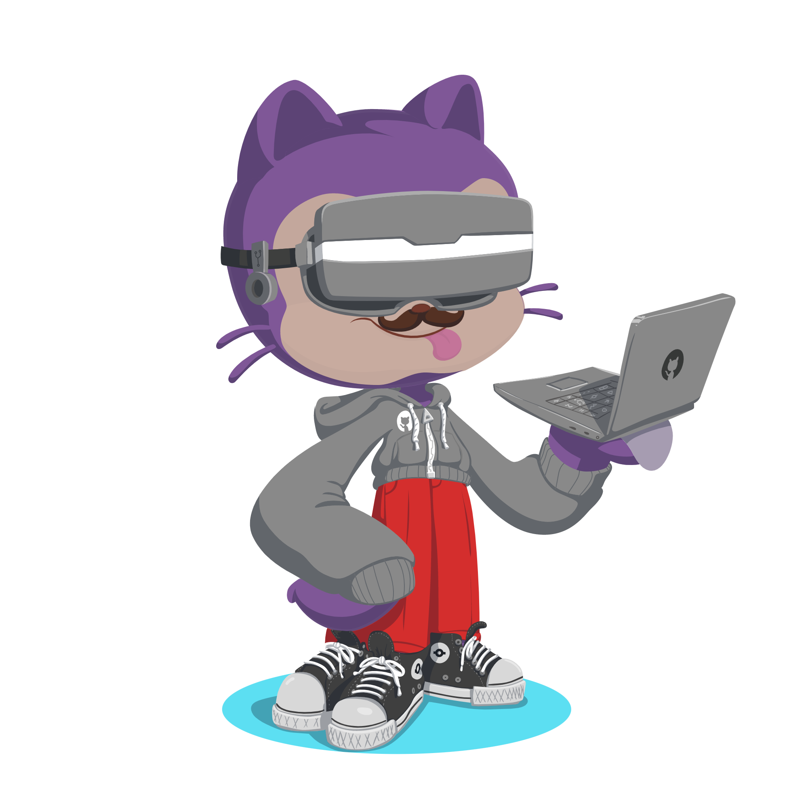

  
  
  <h1>Pedro Igor</h1>
  
<em>VR Developer · Flutter & Android Engineer · Researcher</em>

  
  
  
  
  

---

## About me

Computer Scientist and VR Developer focused on building immersive experiences and training simulations. I work with real-time 3D environments and interactive systems at **Inflection Softworks**, combining applied research with practical engineering.

My work spans Virtual Reality development with Unreal Engine, mobile development with Flutter and Jetpack Compose, and ongoing independent research at the intersection of XR, human-computer interaction, and cognitive science.

📍 Ouro Preto, MG — Brazil  
🏢 VR Developer at [Inflection Softworks](https://www.inflectionsoftworks.com)  
🔬 Independent researcher — XR, HCI, and cognitive systems  
🎓 B.Sc. in Computer Science — Federal University of Ouro Preto (UFOP)  
🌐 Languages: Portuguese (native) · English (professional)

---

## Tech Stack

### Virtual Reality

  

> Unreal Engine · Meta Quest 3 · JetBrains Rider

### Mobile & Cross-platform

  
  
  

> Flutter · Dart · Kotlin · Jetpack Compose

### General & Research

  

### Tools & Environment

  
  
  
  

---

## Publications

| Year | Title | Venue |
|------|-------|-------|
| 2025 | [Mitigating Non-IID Distribution Impacts in Federated Learning for Recommendation Systems](https://doi.org/10.5753/sbbd.2025.247258) | SBBD 2025 |
| 2024 | [Proposal for a tool for the applicability of VR and BCI in an interdisciplinary study to infer attention in individuals with ADHD](https://doi.org/10.1145/3702038.3702075) | ACM 2024 |
| 2024 | [Um estudo inicial sobre as contribuições de Realidade Virtual para avaliação do índice de atenção de pessoas com TDAH](https://doi.org/10.5753/ercas.2024.238721) | ERCAS 2024 |
| 2021 | [CitoFocus: Uma Plataforma para Colaboração e Aprendizado em Citopatologia](https://doi.org/10.5753/sbcas.2021.16083) | SBCAS 2021 |

**Undergraduate Thesis**

| Year | Title | Institution |
|------|-------|-------------|
| 2024 | [Realidade virtual e tecnologias emergentes para pessoas com TDAH: um projeto baseado em experiência](http://www.monografias.ufop.br/handle/35400000/8259) | UFOP |

---
